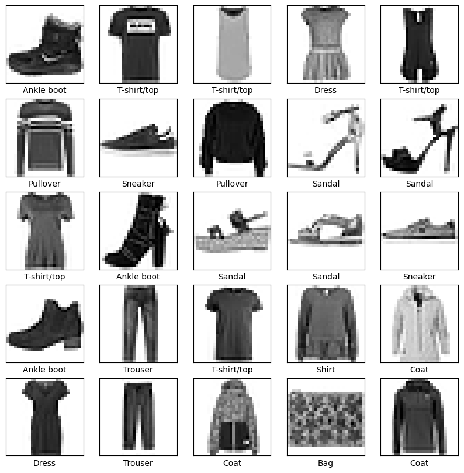
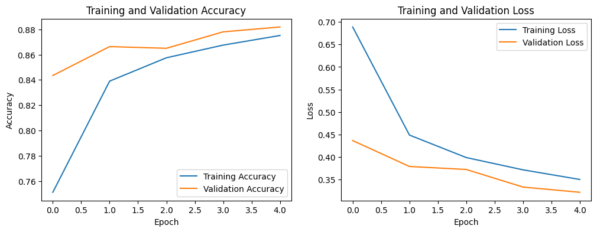
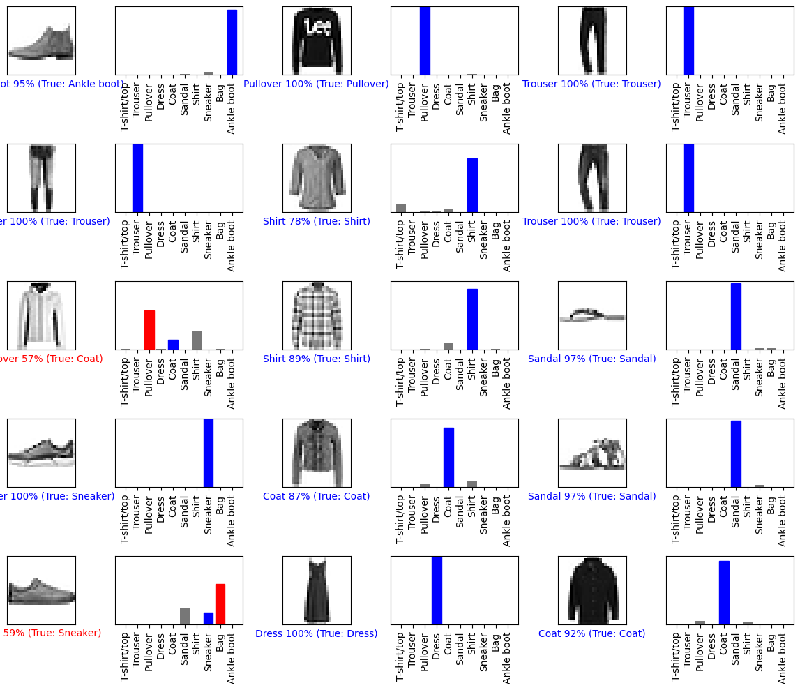
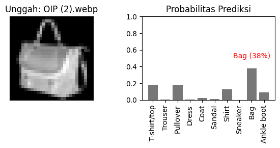

# 👗 Klasifikasi Fashion Menggunakan CNN

[](https://colab.research.google.com/github/achmadhadikurnia/klasifikasi-fashion-menggunakan-cnn/blob/main/Klasifikasi_Fashion_Menggunakan_CNN.ipynb)

Proyek ini mengimplementasikan model **Convolutional Neural Network (CNN)** untuk mengklasifikasikan gambar artikel pakaian menggunakan dataset **Fashion MNIST**. Notebook ditulis dalam Bahasa Indonesia dan dirancang untuk dijalankan di **Google Colab**.

## 📋 Deskripsi

Model CNN dibangun menggunakan TensorFlow/Keras untuk mengenali 10 kategori pakaian dari gambar grayscale berukuran 28×28 piksel. Proyek ini mencakup seluruh alur kerja machine learning mulai dari pemuatan data, pelatihan model, evaluasi, hingga prediksi pada gambar baru yang diunggah pengguna.

## 🏷️ Kategori Kelas

| No | Kelas         |
|----|---------------|
| 0  | T-shirt/top   |
| 1  | Trouser       |
| 2  | Pullover      |
| 3  | Dress         |
| 4  | Coat          |
| 5  | Sandal        |
| 6  | Shirt         |
| 7  | Sneaker       |
| 8  | Bag           |
| 9  | Ankle boot    |

## 🏗️ Arsitektur Model

```
Input (28, 28, 1)
    │
    ├── Conv2D (32 filter, 3×3, ReLU)
    ├── MaxPooling2D (2×2)
    ├── Conv2D (64 filter, 3×3, ReLU)
    ├── MaxPooling2D (2×2)
    ├── Flatten
    ├── Dropout (0.5)
    └── Dense (10 unit, Softmax)
```

## 📂 Struktur Proyek

```
klasifikasi-fashion-menggunakan-cnn/
├── screenshots/                                # Hasil screenshot notebook
│   ├── melakukan-prediksi.png
│   ├── melatih-model-cnn.png
│   ├── memuat-dan-mempersiapkan-dataset.png
│   └── uji-model-dengan-gambar-diunggah.png
├── Klasifikasi_Fashion_Menggunakan_CNN.ipynb    # Notebook utama
├── LICENSE                                     # Lisensi MIT
└── README.md                                   # Dokumentasi proyek
```

## 🚀 Cara Menjalankan

### Menggunakan Google Colab (Direkomendasikan)

1. Buka file `Klasifikasi_Fashion_Menggunakan_CNN.ipynb` di [Google Colab](https://colab.research.google.com/).
2. Jalankan semua sel secara berurutan dari atas ke bawah.
3. Dataset Fashion MNIST akan diunduh secara otomatis oleh Keras.

### Menggunakan Lingkungan Lokal

1. **Clone repositori ini:**
   ```bash
   git clone https://github.com/achmadhadikurnia/klasifikasi-fashion-menggunakan-cnn.git
   cd klasifikasi-fashion-menggunakan-cnn
   ```

2. **Instal dependensi:**
   ```bash
   pip install tensorflow numpy matplotlib pillow opencv-python
   ```

3. **Jalankan notebook:**
   ```bash
   jupyter notebook Klasifikasi_Fashion_Menggunakan_CNN.ipynb
   ```

> **Catatan:** Fitur unggah gambar pada bagian akhir notebook menggunakan `google.colab.files.upload()`, sehingga hanya berfungsi di Google Colab. Untuk penggunaan lokal, bagian tersebut perlu dimodifikasi.

## 📓 Isi Notebook

Notebook ini terdiri dari beberapa bagian utama:

1. **Import Library** — Mengimpor TensorFlow, Keras, NumPy, dan Matplotlib.

2. **Memuat & Mempersiapkan Data** — Memuat dataset Fashion MNIST, melakukan normalisasi, dan menampilkan contoh gambar.

   

3. **Membangun Model CNN** — Mendefinisikan arsitektur CNN dengan lapisan konvolusi, pooling, dropout, dan dense.

4. **Melatih Model** — Melatih model selama 5 epoch dengan batch size 128 dan validation split 10%, serta memvisualisasikan akurasi dan loss.

   

5. **Mengevaluasi Model** — Mengukur akurasi dan loss pada data pengujian.

6. **Melakukan Prediksi** — Memprediksi kelas gambar pengujian dan menampilkan hasil beserta confidence score.

   

7. **Uji dengan Gambar Sendiri** — Mengunggah gambar kustom untuk diprediksi oleh model.

   

## 🛠️ Teknologi yang Digunakan

| Teknologi    | Kegunaan                                |
|--------------|-----------------------------------------|
| Python 3     | Bahasa pemrograman utama                |
| TensorFlow   | Framework deep learning                 |
| Keras        | API high-level untuk membangun model    |
| NumPy        | Manipulasi array dan data numerik       |
| Matplotlib   | Visualisasi data dan hasil prediksi     |
| Pillow (PIL) | Pemrosesan gambar yang diunggah         |
| OpenCV       | Pemrosesan gambar tambahan              |

## 📊 Dataset

**Fashion MNIST** ([Zalando Research](https://github.com/zalandoresearch/fashion-mnist)):
- **Training set:** 60.000 gambar grayscale 28×28 piksel
- **Test set:** 10.000 gambar grayscale 28×28 piksel
- **Jumlah kelas:** 10 kategori pakaian

Dataset ini merupakan pengganti drop-in untuk dataset MNIST klasik, dirancang sebagai benchmark yang lebih menantang untuk algoritma machine learning.

## 📝 Lisensi

Proyek ini dilisensikan di bawah [MIT License](LICENSE).

---

⭐ Jangan lupa beri bintang pada repositori ini jika bermanfaat!
